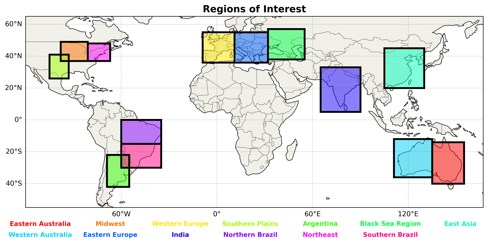

# Exploring Operational Improvements to Long-Term Weather Forecasting Using Teleconnection Pattern Analysis
Team Members:
* Tyson Stewart (Project Lead and ML Model Designer)
* Landon Moeller (Methodology Lead and MLR Model Designer)
* Matthew Woods (Support Team)
* Owen Cutinello (Support Team)
* Logan Bundy (Everstream Liason)

This project was created as part of a collaboration between Northern Illinois University and Everstream Analytics as part of the NIU MET 431/531 course. All rights are reserved by Everstream with credit given to each team member's contributions. For more information, contact Logan Bundy (logan.bundy@everstream.ai).

## Project Summary

This project sought to explore the creation of operational models/frameworks for integrating teleconnection indices/analyses into actionable mid-range climate forecasts. To perform this, teleconnection indices (see Teleconnections Utilized) were analyzed based on their coorelation with temperature and precipitation anomalies across 13 geographic regions (See Regions of Interest). From these analyses, the top 5 coorelated teleconnections were implemented into both a Multi-Linear Regression (MLR) and Random Forest (RF) model. From there, performance was compared to eachother, and future operational improvements/usages were discussed.

For more information on the results of this project, see the included reports and presentation files in the "Reports and Documentation" folder.

## Prerequisite Packages

* cartopy
* ipywidgets
* matplotlib
* numpy
* pandas
* scipy
* sklearn
* statsmodels
* xarray
* ydf

## Teleconnections Utilized

Note that all teleconnection index data for 19XX-2024 is included in the "Data" folder for convenience.

| Teleconnection Index Name  | Abbreviation  | Domain  |
|:---:|:---:|:---:|
| El Nino-Southern Oscillation  | ENSO 3.4  | Global  |
| Multivariate ENSO Index  | MEI  | Global  |
| Quasi-Biennial Oscillation  | QBO  | Global  |
| Indian Ocean Dipole  | IOD  | Global  |
| ENSO Modoki Index  | EMI  | Global  |
| Interdecadal Pacific Oscillation  | IPO  | Global  |
| Globally Averaged Angular Momentum  | AAM-ANOM  | Global  |
| North Atlantic Oscillation  | NAO  | Northern Hemisphere  |
| Arctic Oscillation  | AO  | Northern Hemisphere  |
| Western Pacific Oscillation  | WPO  | Northern Hemisphere  |
| Eastern Pacific Oscillation  | EPO  | Northern Hemisphere  |
| Pacific North American Pattern  | PNA  | Northern Hemisphere  |
| Pacific Decadal Oscillation  | PDO  | Northern Hemisphere  |
| Atlantic Multidecadal Oscillation  | AMO  | Northern Hemisphere  |
| Tropical North Atlantic Index  | TNA  | Northern Hemisphere  |
| West Pacific Pattern  | WP  | Northern Hemisphere  |
| East Atlantic Pattern  | EA  | Northern Hemisphere  |
| Scandinavian Pattern  | SCA  | Northern Hemisphere  |
| Polar/Eurasia Pattern  | POL  | Northern Hemisphere  |
| East Atlantic/West Russia Pattern  | EAWR  | Northern Hemisphere  |
| East Pacific/North Pacific Oscillation  | EPNP  | Northern Hemisphere  |
| Northern Oscillation Index  | NOI  | Northern Hemisphere  |
| Arctic Dipole Index  | ADI  | Northern Hemisphere  |
| Southern Oscillation Index  | SOI  | Southern Hemisphere  |
| Tropical Southern Atlantic Index  | TSA  | Southern Hemisphere  |
| Antarctic Oscillation  | AAO  | Southern Hemisphere  |
| Southern Atlantic Ocean Dipole  | SAOD  | Southern Hemisphere  |
| Southern Pacific Ocean Dipole  | SPOD  | Southern Hemisphere  |
| Trans-Polar Index  | TPI  | Southern Hemisphere  |

## Regions of Interest

  

  <em>The 13 regions of interest for Everestream Analytics.</em>

